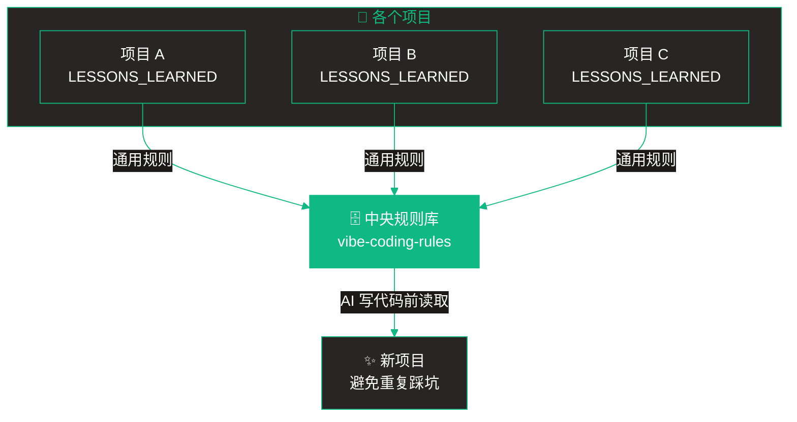
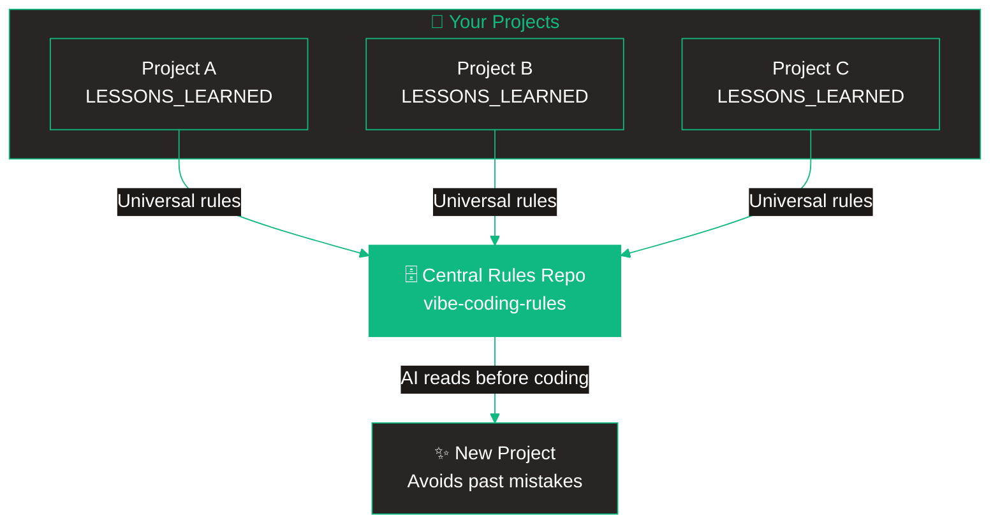

# Vibe Coding Rules

> [中文](#中文) | [English](#english)

---

<a name="中文"></a>
## 中文

> 你的个人编码规则库 - 让 AI 助手不重复犯错

这是一个 [Vibe Coding](https://en.wikipedia.org/wiki/Vibe_coding) 知识管理系统。收集开发过程中踩过的坑，让 AI 编码助手（Claude Code、Cursor、Windsurf 等）参考你的规则，避免重复犯错。

### 快速开始

#### 第一步：Fork 这个仓库

点击 **"Use this template"** 或 **Fork** 创建你自己的副本。

#### 第二步：配置新项目

新项目开始时，把这段 prompt 发给 AI：

```
帮我配置编码规则系统：

1. 读取我的规则库：https://github.com/你的用户名/vibe-coding-rules
   - 阅读 MASTER_RULES.md 了解核心规则
   - 根据本项目技术栈阅读 by-stack/ 下的相关文件

2. 在项目根目录创建 CLAUDE.md：
   - 引用上述规则库链接
   - 写明项目名称、技术栈、简述
   - 包含指令：「修复 bug 后主动询问是否记录」

3. 创建空的 LESSONS_LEARNED.md 用于记录

4. 从现在开始，每次修复 bug 后：
   - 问我：「要记录这个问题吗？」
   - 如果我说「记录」，追加到 LESSONS_LEARNED.md
   - 格式：标题、日期、类型、原因、解决方案、代码示例

5. 当我说「同步到中央规则库」时，先审核：
   - 通用性：其他项目会遇到吗？
   - 质量：有代码示例？有根因分析？
   - 重复：规则库里已有类似的吗？
   - 审核通过才同步，否则告诉我原因

现在开始配置。
```

#### 第三步：开发过程中

1. AI 写代码前会读取你的规则
2. 修复 bug 后，AI 询问是否记录
3. 你说「记录」→ 保存到 `LESSONS_LEARNED.md`
4. 通用问题 → 同步到中央规则库

#### 第四步：定期汇总

检查各项目的 `LESSONS_LEARNED.md`，把通用规则同步到这个仓库。

### 工作原理



### 目录结构

```
vibe-coding-rules/
├── MASTER_RULES.md              # 核心规则（必读）
├── RULE_QUALITY_CHECKLIST.md    # 质量检查清单
├── by-category/                 # 按问题类型分类
│   ├── time-and-timezone.md     # 时间时区
│   ├── error-handling.md        # 错误处理
│   ├── user-input.md            # 用户输入
│   └── database.md              # 数据库
├── by-stack/                    # 按技术栈分类
│   ├── nextjs.md
│   ├── react.md
│   └── supabase.md
└── templates/                   # 配置模板
    ├── SETUP_PROMPT.md          # 配置 prompt
    ├── REVIEW_PROMPT.md         # 审核 prompt
    ├── CLAUDE.md                # 项目模板
    └── LESSONS_LEARNED.md       # 记录模板
```

### 质量门槛

规则同步前必须通过审核：

1. **通用性** - 其他项目也会遇到这个问题
2. **质量** - 有代码示例和根因分析
3. **不重复** - 规则库里没有类似的

---

<a name="english"></a>
## English

> Your personal coding rules library - Help AI assistants avoid repeating mistakes

A knowledge management system for [Vibe Coding](https://en.wikipedia.org/wiki/Vibe_coding). Collect lessons learned during development, so AI coding assistants (Claude Code, Cursor, Windsurf, etc.) can reference your rules and avoid making the same mistakes twice.

### Quick Start

#### Step 1: Fork this repo

Click **"Use this template"** or **Fork** to create your own copy.

#### Step 2: Set up a new project

Copy this prompt to your AI assistant when starting a new project:

```
Set up my coding rules system:

1. Read my rules: https://github.com/YOUR_USERNAME/vibe-coding-rules
   - Read MASTER_RULES.md for core rules
   - Read by-stack/ files matching this project's tech stack

2. Create CLAUDE.md in project root with:
   - Link to my rules repo
   - Project name, tech stack, description
   - Instruction: "After fixing bugs, ask if I want to record it"

3. Create empty LESSONS_LEARNED.md for recording issues

4. From now on, after fixing any bug:
   - Ask me: "Record this issue?"
   - If yes, append to LESSONS_LEARNED.md
   - Format: title, date, type, cause, solution, code example

5. When I say "sync to central rules", first review:
   - Universality: Will other projects face this?
   - Quality: Has code examples? Root cause analysis?
   - Duplicates: Already exists in rules repo?
   - Only sync if passes, otherwise explain why

Start setup now.
```

#### Step 3: During development

1. AI reads your rules before coding
2. After fixing bugs, AI asks if you want to record
3. You say "record" → saved to `LESSONS_LEARNED.md`
4. Universal issues → sync to central rules repo

#### Step 4: Periodic sync

Review `LESSONS_LEARNED.md` from your projects and sync universal rules to this repo.

### How It Works



### Directory Structure

```
vibe-coding-rules/
├── MASTER_RULES.md              # Core rules (required reading)
├── RULE_QUALITY_CHECKLIST.md    # Quality checklist
├── by-category/                 # Rules by problem type
│   ├── time-and-timezone.md
│   ├── error-handling.md
│   ├── user-input.md
│   └── database.md
├── by-stack/                    # Rules by tech stack
│   ├── nextjs.md
│   ├── react.md
│   └── supabase.md
└── templates/                   # Templates for setup
    ├── SETUP_PROMPT.md
    ├── REVIEW_PROMPT.md
    ├── CLAUDE.md
    └── LESSONS_LEARNED.md
```

### Quality Gate

Rules must pass review before syncing:

1. **Universality** - Other projects will face this issue
2. **Quality** - Has code examples and root cause analysis
3. **No Duplicates** - Not already in the rules repo

---

## 规则格式 / Rule Format

```markdown
### [问题标题 / Problem Title]

- **级别 / Level**: 必须 / 强烈建议 / 建议
- **来源 / Source**: 项目名称
- **问题 / Problem**: 发生了什么
- **根因 / Root Cause**: 为什么发生
- **方案 / Solution**: 如何修复
- **代码示例 / Code Example**:
  ```typescript
  // 错误 / Bad
  ...

  // 正确 / Good
  ...
  ```
```

---

## License

MIT
